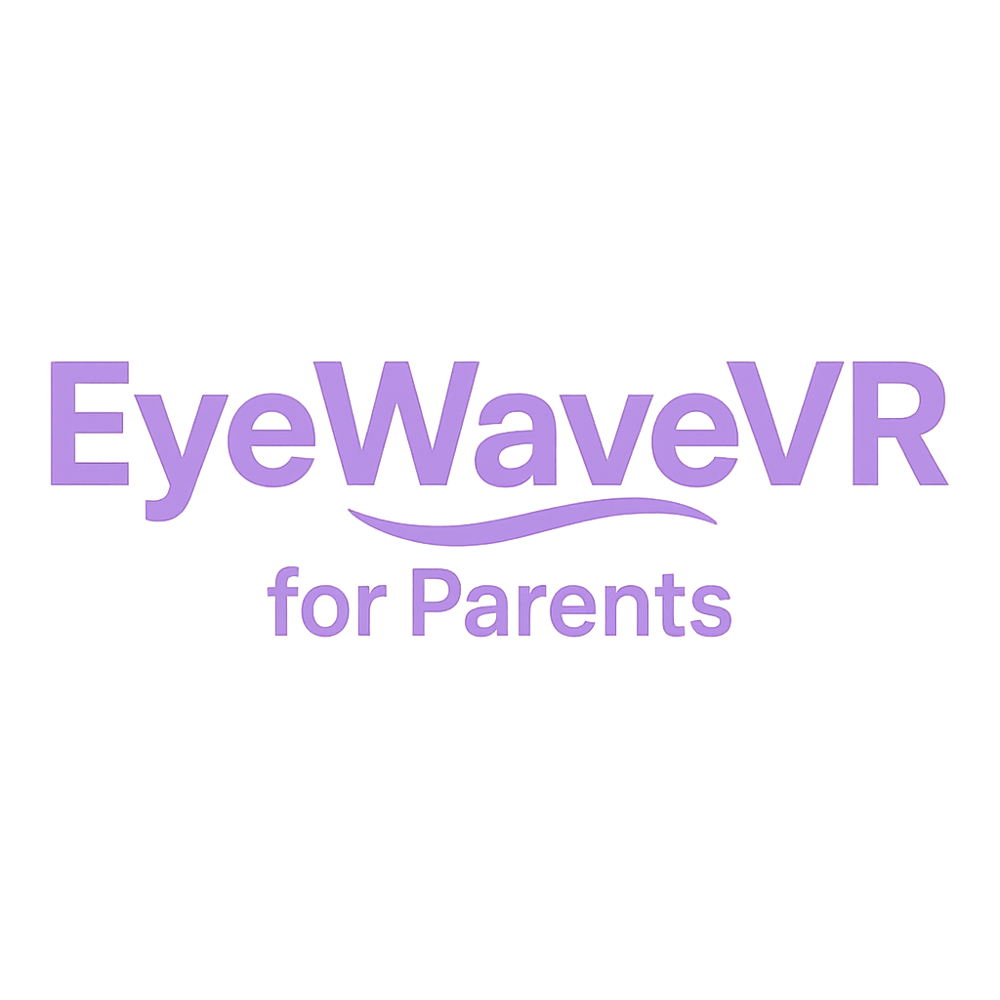
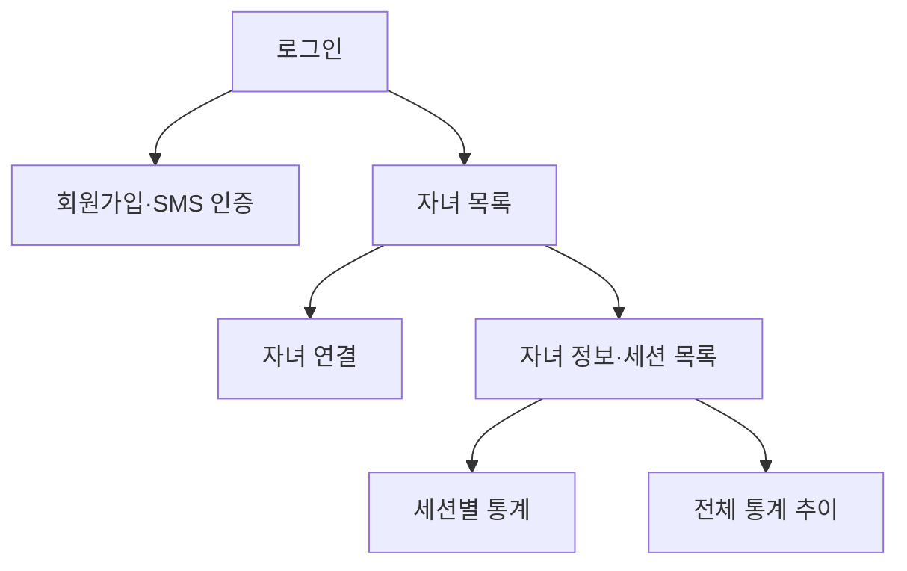

<p align="center">
  
</p>

# EyeWaveVR for Parents

VR 아이트래킹과 EEG 기반 훈련 결과를 보호자가 확인하는 React Native 모바일 앱입니다.

EyeWaveVR 시스템에서 수집·분석한 자녀의 훈련 세션, 집중도 점수, 충동 억제 점수와 ADHD 상태를 백엔드 API로 조회해 iOS·Android 화면에 제공합니다. 이 저장소의 범위는 **보호자용 모바일 앱**이며, Unity VR 콘텐츠와 생체 신호 수집 모듈, 백엔드 서버, 의료진용 웹 대시보드는 포함하지 않습니다.

> [!IMPORTANT]
> 앱에 표시되는 점수와 상태는 훈련 결과를 확인하기 위한 참고 정보이며 의료인의 진단이나 치료를 대신하지 않습니다. 최종보고서에 따르면 현재 평가 로직은 임상 전문가 검토와 실제 환아 대상 유효성 검증이 추가로 필요합니다.

## 주요 기능

- 보호자 로그인 및 액세스 토큰 관리
- SMS 인증을 이용한 보호자 회원가입
- 자녀 ID와 6자리 인증번호를 이용한 자녀 연결
- 보호자에게 연결된 자녀 목록 및 상세 정보 조회
- 자녀별 훈련 세션 조회와 페이지 이동
- 세션별 집중도·충동 억제 점수 및 정상·주의·위험 상태 표시
- 전체 세션의 점수 변화 차트와 상태 요약 제공
- 인증 만료 시 토큰 삭제 후 로그인 화면으로 이동

## 화면 흐름



| 화면 | 역할 |
| --- | --- |
| `LoginScreen` | 보호자 로그인 |
| `SignupScreen` | SMS 인증 및 보호자 회원가입 |
| `ChildListScreen` | 보호자 정보와 연결된 자녀 목록 조회 |
| `AddChildScreen` | 자녀 ID 인증 및 보호자-자녀 연결 |
| `ChildDetailScreen` | 자녀 기본 정보와 훈련 세션 목록 조회 |
| `StatsScreen` | 선택한 세션의 집중도·충동 억제 점수와 상태 조회 |
| `ChildTrendScreen` | 전체 세션 점수 차트와 상태 변화 요약 |

## 기술 스택

| 구분 | 기술 |
| --- | --- |
| 앱 | React Native 0.79.2, React 19, Expo SDK 53 |
| UI | Tamagui, Moti, React Native Reanimated |
| 내비게이션 | React Navigation Native Stack 7 |
| API | Axios |
| 인증 정보 저장 | React Native AsyncStorage |
| 차트 | React Native Chart Kit, React Native SVG |
| 빌드 | Expo CLI, EAS Build |

## 시작하기

### 준비 사항

- Node.js와 Yarn
- 실행 가능한 EyeWaveVR 백엔드 API
- Android: Android Studio, Android SDK, 에뮬레이터 또는 개발용 기기
- iOS: macOS, Xcode, CocoaPods, 시뮬레이터 또는 개발용 기기

SMS 인증과 자녀 연결 기능을 확인하려면 인증번호 발송이 가능한 백엔드 환경과 테스트 계정이 필요합니다.

### 설치

```bash
yarn install
```

iOS를 처음 빌드하거나 네이티브 의존성이 변경된 경우 Pod을 설치합니다.

```bash
cd ios
pod install
cd ..
```

### 실행

Android:

```bash
yarn android
```

iOS:

```bash
yarn ios
```

Metro 개발 서버:

```bash
yarn start
```

### 코드 검사

```bash
yarn lint
```

## API 설정

API 주소와 인증 인터셉터는 [`src/api/api.js`](./src/api/api.js)에 정의되어 있습니다.

```js
const api = axios.create({
  baseURL: 'https://api-hlp.o-r.kr',
})
```

현재 별도의 `.env` 파일을 사용하지 않습니다. 서버 주소를 변경하려면 `baseURL`을 수정해야 합니다. 로그인 후 받은 `accessToken`은 AsyncStorage에 저장되며 이후 요청의 `Authorization: Bearer <token>` 헤더에 자동으로 추가됩니다.

앱은 다음 보호자 API를 사용합니다.

- 로그인, 회원가입, SMS 인증
- 보호자 정보 조회
- 자녀 목록 조회, 자녀 인증 및 연결
- 자녀 상세 정보와 훈련 세션 조회
- 세션별 통계와 전체 통계 추이 조회

## 프로젝트 구조

```text
.
├── App.js                         # 앱 진입점과 화면 내비게이션
├── src
│   ├── api
│   │   └── api.js                 # Axios 인스턴스와 인증 처리
│   ├── components
│   │   └── PhoneAuth.jsx          # SMS 인증 컴포넌트
│   ├── screens
│   │   ├── LoginScreen.jsx
│   │   ├── SignupScreen.jsx
│   │   ├── ChildListScreen.jsx
│   │   ├── AddChildScreen.jsx
│   │   ├── ChildDetailScreen.jsx
│   │   ├── StatsScreen.jsx
│   │   └── ChildTrendScreen.jsx
│   └── utils
│       ├── NavigationService.js   # 인증 만료 시 화면 초기화
│       ├── colors.ts              # 브랜드 색상
│       └── storage.js             # 액세스 토큰 저장·조회·삭제
├── assets                         # 로고, 아이콘, 스플래시 이미지
├── android                        # Android 네이티브 프로젝트
├── ios                            # iOS 네이티브 프로젝트
├── tamagui.config.ts              # Tamagui 테마
├── app.json                       # Expo 앱 설정
├── eas.json                       # EAS 빌드 설정
└── package.json                   # 의존성과 실행 스크립트
```
